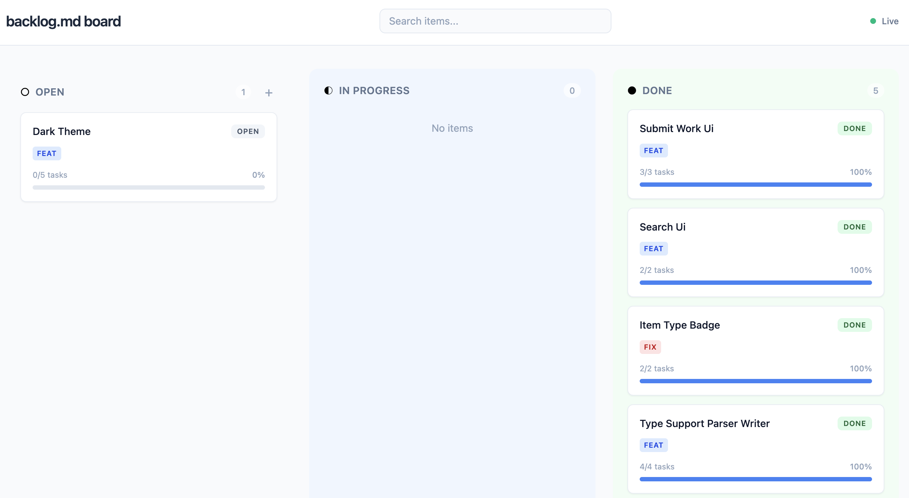
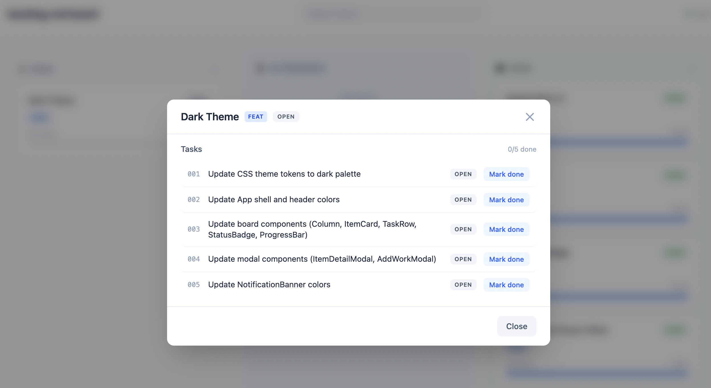

# backlogmd-utils

Monorepo for [BacklogMD](https://github.com/backlogmd/backlogmd) — a markdown-based project management tool. Manage your backlog as plain `.md` files and get a live kanban dashboard that watches your changes in real time.

## Quick start

```bash
npx @backlogmd/serve --dir your-project-repo/.backlogmd
```

This starts a local dashboard at `http://localhost:3030` that reads your `.backlogmd/` directory, renders a kanban board, and **watches for file changes** — every time you edit a markdown file, the board updates automatically via Server-Sent Events.





### Options

```
--dir   Path to the project root (default: cwd)
--port  Port number (default: 3030)
--host  Host address (default: localhost)
```

## How it works

BacklogMD stores your backlog as markdown files inside a `.backlogmd/` directory:

```
.backlogmd/
├── backlog.md              # backlog entries
└── work/
    └── my-feature/
        ├── index.md        # item overview with task references
        ├── 001-task.md     # individual task files
        └── 002-task.md
```

The serve package watches this directory and keeps a live kanban board in sync. You can update task statuses directly from the dashboard — changes are written back to disk as surgical markdown edits.

## Packages

| Package                              | Description                                                      |
| ------------------------------------ | ---------------------------------------------------------------- |
| [@backlogmd/serve](packages/serve)   | Dev server with live dashboard, file watcher, and SSE            |
| [@backlogmd/writer](packages/writer) | Surgical markdown writer — applies patches without full rewrites |
| [@backlogmd/parser](packages/parser) | Parses `.backlogmd/` files into canonical JSON                   |
| [@backlogmd/types](packages/types)   | Shared TypeScript types and protocol helpers                     |

## Development

```bash
npm install
npm run build --workspaces
npm test
```

Requires Node >= 22.
